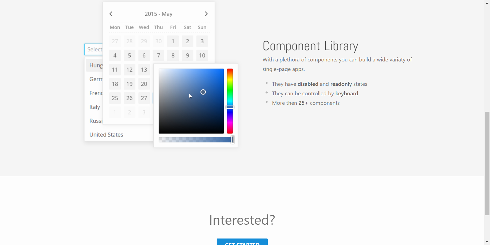
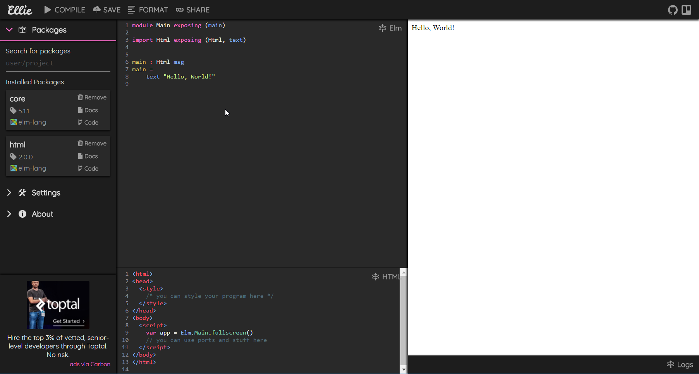
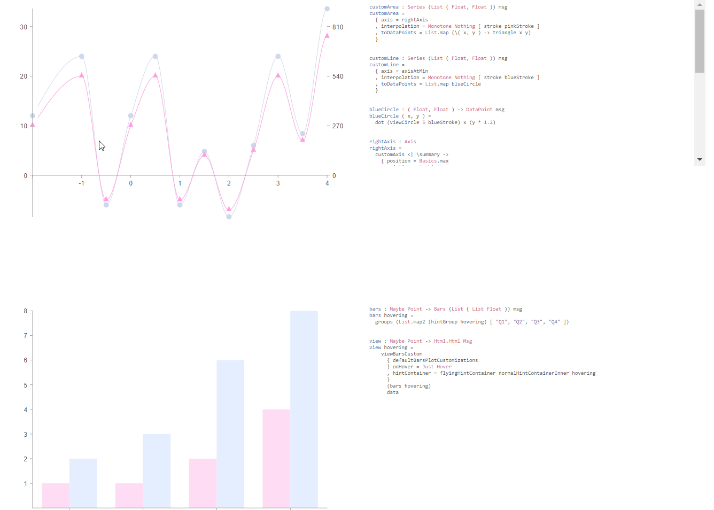
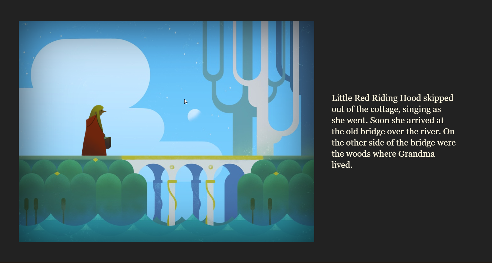
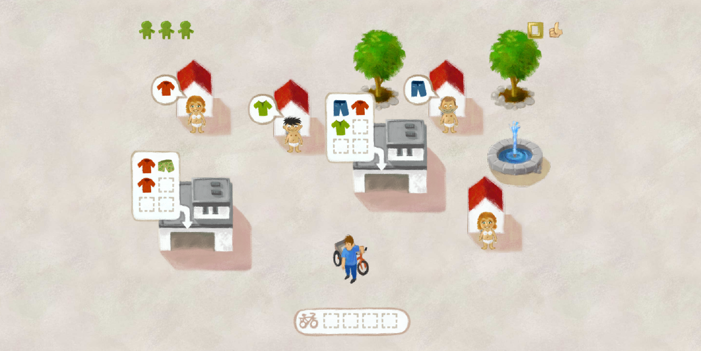

---?image=assets/elm-logo.png&size=auto 90%
@title[Made with Elm]
# Made with Elm, made for Elm

---
@title[Elm-UI]
# Elm-UI
## Component library

---

@title[Ellie]

# [Ellie](https://ellie-app.com/new)
## Online Elm IDE
+++

---
@title[elm-plot]
# [elm-plot](https://github.com/terezka/elm-plot)
## Plotting library for Elm
+++

---
@title[Elm narrative engine]

# [Elm narrative engine](http://elmnarrativeengine.com/)
## Tool for game narratives

---
@title[Zalando's 404 Elm Street game]
# [Zalando's 404 Elm Street game](https://github.com/zalando/elm-street-404)
## Hack week project where you play as a Zalando courier
### [Read the blog post](https://jobs.zalando.com/tech/blog/using-elm-to-create-a-fun-game-in-just-five-days/)
+++

---
@title[Pivotal tracker]
# [Pivotal Tracker's](www.pivotaltracker.com) dashboard and further code
PivotalTracker is a project management tool
##  Read their [blog post about using Elm](https://www.pivotaltracker.com/blog/Elm-pivotal-tracker/)
---
@title[NoRedInk]
# NoRedInk
## Software for English teachers
# over 200 000 lines of Elm code
## "no runtime exceptions since 2015" (in Elm code) 

Watch [Elm in production](https://www.youtube.com/watch?v=XsNk5aOpqUc&t=1s) talk by Richard Feldman

